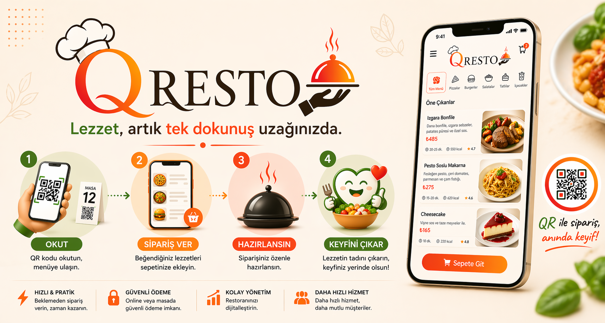
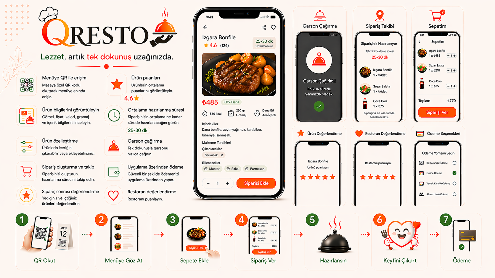
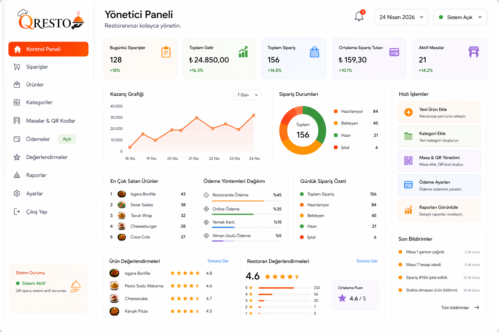
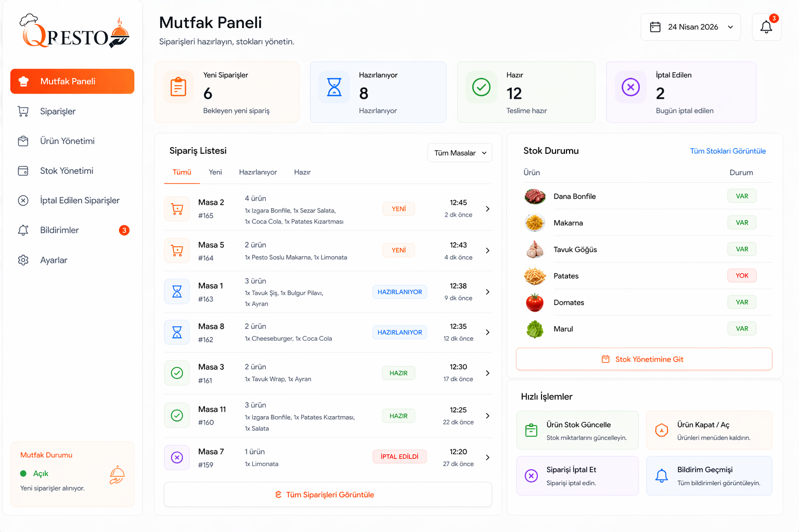
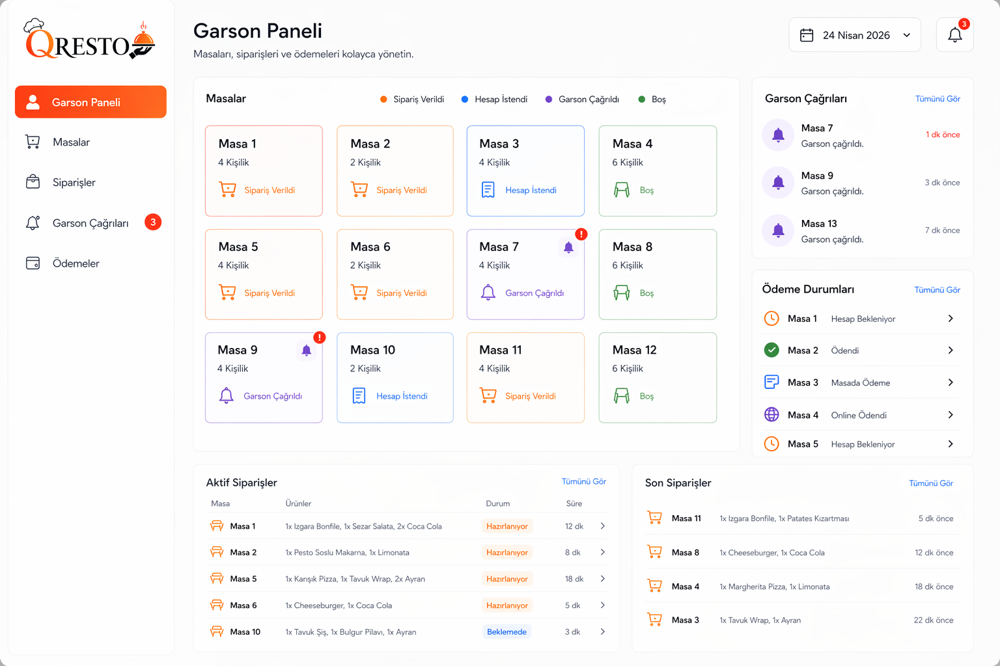
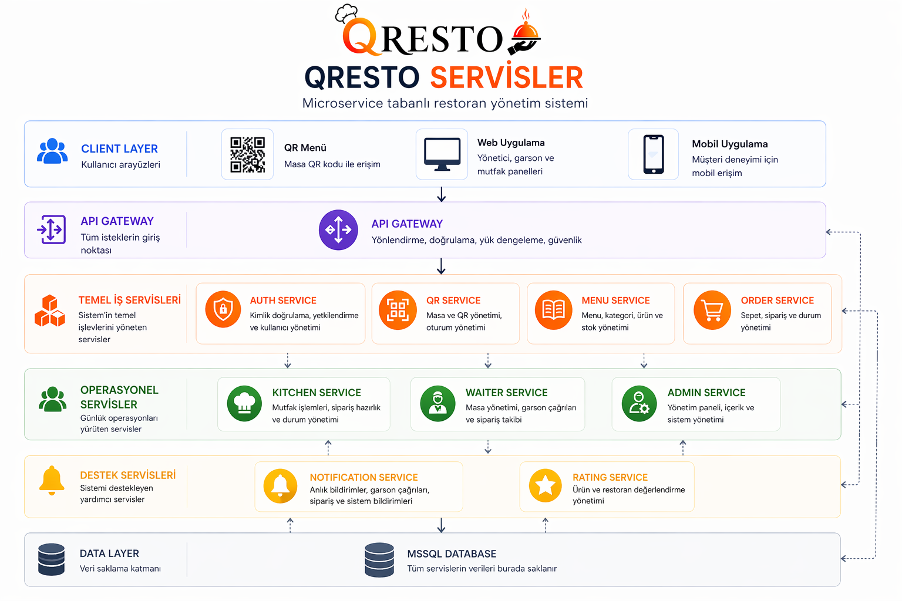
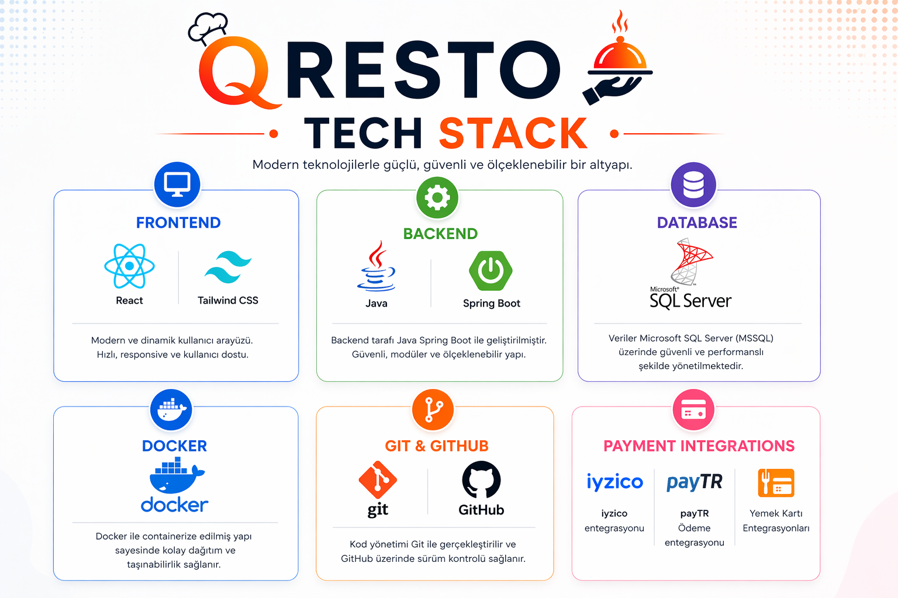
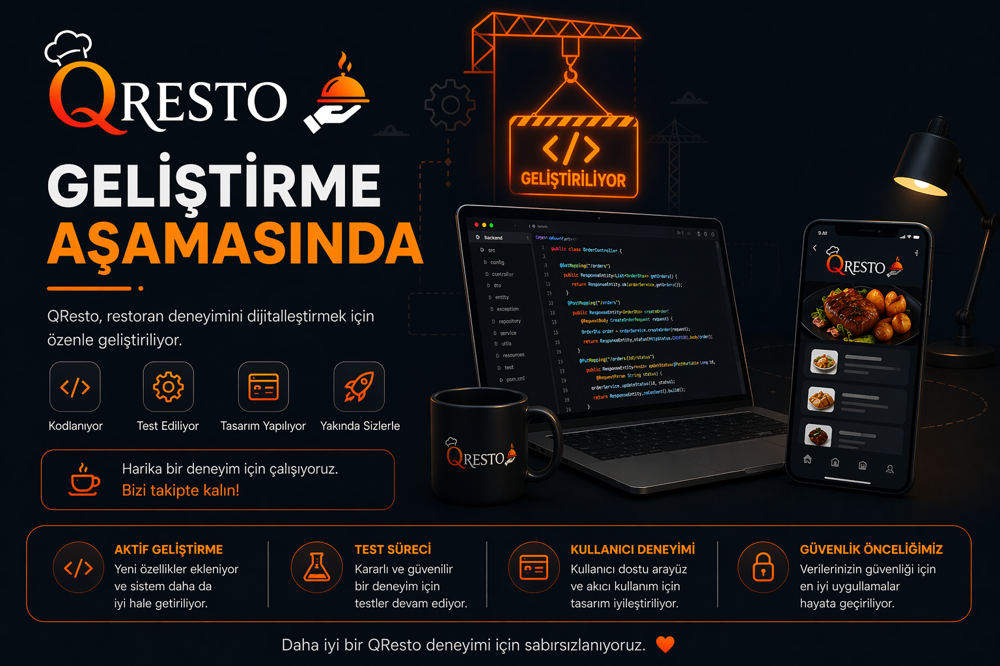

# QResto

## 📱 Okut • Sipariş Ver • Hazırlansın • Keyfini Çıkar

QResto, restoranlar için geliştirilmiş **QR tabanlı dijital sipariş ve yönetim platformudur**.  
Müşteriler masalarına özel QR kodları okutarak menüye erişebilir, sipariş verebilir, sipariş sürecini takip edebilir, garson çağırabilir ve ödeme işlemlerini dijital olarak tamamlayabilir.

**All rights reserved.**  
Unauthorized copying, distribution, modification, deployment or use of this project is strictly prohibited.

---

## ✨ Proje Özeti

QResto ile müşteriler:

- 📋 Menüye anında erişir
- ⭐ Ürün değerlendirmelerini görüntüler
- ⏱️ Hazırlanma süresini takip eder
- 🍔 Ürünleri özelleştirir
- 🛎️ Garson çağırır
- 💳 Uygulama üzerinden ödeme yapar

---

## 🚀 Detaylı Özellikler

### 👤 Müşteri Deneyimi

- QR ile menüye erişim
- Ürün görselleri, fiyat, içerik, kalori ve gramaj bilgileri
- Ürün puanları ve değerlendirmeler
- Ortalama hazırlanma süresi görüntüleme
- Ürün özelleştirme (ekle / çıkar)
- Garson çağırma
- Sipariş oluşturma ve takip etme
- Uygulama üzerinden ödeme
- Sipariş sonrası ürün değerlendirme
- Restoran değerlendirme

### 💳 Ödeme Sistemi

- Restoranda ödeme
- Online ödeme
- Yemek kartı ile ödeme
- Alman usulü ödeme (split payment)

---

## 👥 Sistem Rolleri

### 🧑‍💻 Yönetici 

- Ödeme sistemini açıp kapatır
- Ürün ekler / siler / düzenler
- Kategorileri yönetir
- Masa ve QR yönetimini yapar
- Ürün değerlendirmelerini görüntüler
- Restoran değerlendirmelerini analiz eder
- Günlük satış, sipariş ve operasyon raporlarını görüntüler

### 👨‍🍳 Mutfak 

- Yeni ve aktif siparişleri görüntüler
- Sipariş hazırlık sürecini yönetir
- Stoğu biten ürünleri satışa kapatır
- Menüden ürün düşürür
- Gerekli durumlarda sipariş iptal eder

### 🧑‍💼 Garson 

- Siparişleri ve detaylarını görüntüler
- Masaları takip eder
- Garson çağrılarını görür
- Hesap isteyen masaları takip eder
- Sipariş teslim sürecini yönetir
- Ödeme ve sipariş durumlarını kontrol eder

---

## 🧩 QResto Servisler

QResto; kimlik doğrulama, masa/QR yönetimi, menü yönetimi, sipariş süreci, mutfak operasyonları, garson akışı, değerlendirme ve bildirim süreçlerini birbirinden ayrılmış servislerle yönetmek üzere tasarlanmıştır.

## 🧠 Temel Servisler

QResto servis yapısı aşağıdaki ana servislerden oluşur:

- `auth-service`
- `qr-service`
- `menu-service`
- `order-service`
- `kitchen-service`
- `waiter-service`
- `rating-service`
- `notification-service`
- `admin-service`

> Not: `payment-service` proje planında yer almakta olup geliştirme aşamasında sonraya bırakılmıştır.

---

## 🛠️ Tech Stack

### Kullanılan Teknolojiler

- **Frontend:** React, Tailwind CSS
- **Backend:** Java, Spring Boot
- **Database:** Microsoft SQL Server (MSSQL)
- **Containerization:** Docker
- **Version Control:** Git, GitHub
- **Payment Integrations:** iyzico, PayTR, yemek kartı entegrasyonları

---

---

## 📌 License

This project is not open-source.

All rights reserved by the QResto contributors.  
No permission is granted to use, copy, modify, distribute, publish, deploy or present this project without explicit written approval from the project contributors.
